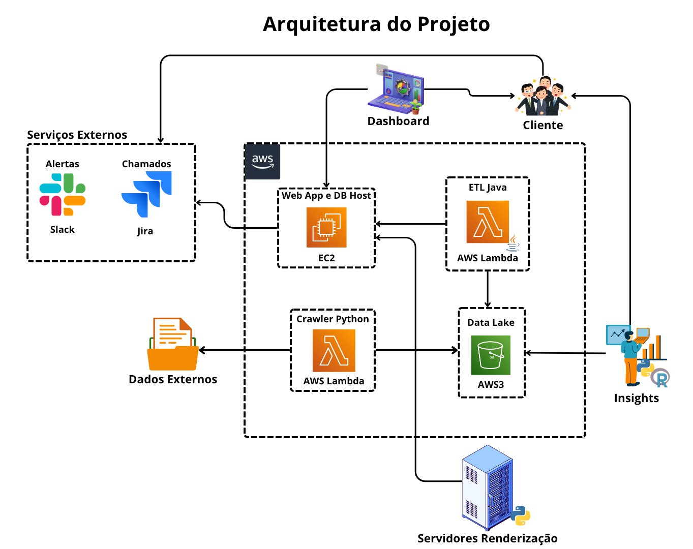

# InfraWatch

## Propósito

A **InfraWatch** surge como uma solução inovadora para o **monitoramento inteligente de Render Farms**, com o objetivo de **garantir a eficiência, previsibilidade e segurança no uso de infraestrutura de servidores de renderização**. A plataforma oferece uma visão integrada e automatizada sobre o desempenho de máquinas de alto processamento, permitindo que empresas foquem na produção de conteúdo enquanto a InfraWatch cuida da estabilidade e performance.

## Contexto

Com a crescente demanda por conteúdos visuais de alta qualidade — como animações 3D, filmes e jogos — cresce também a complexidade dos processos de renderização. Esses processos exigem **infraestruturas de alto desempenho**, compostas por **servidores equipados com múltiplas CPUs e GPUs**.

Nesse cenário, as **Render Farms** se consolidam como uma solução viável, permitindo a **distribuição paralela de tarefas de renderização**. No entanto, a gestão e manutenção dessas farms pode se tornar um gargalo. É aí que entra a **InfraWatch**: oferecendo monitoramento em tempo real, automação de alertas e insights estratégicos para evitar falhas de hardware, perda de dados e custos excessivos com manutenção reativa.

## Arquitetura do Projeto

A arquitetura da InfraWatch foi projetada para garantir **escalabilidade, modularidade e automação**, utilizando serviços em nuvem da AWS e tecnologias modernas para monitoramento e análise de dados.

### Principais Componentes:

- **Servidores de Renderização**: Máquinas de alta performance responsáveis pela renderização dos projetos.
- **Crawler Python (AWS Lambda)**: Captura de dados externos e métricas dos servidores.
- **ETL Java (AWS Lambda)**: Tratamento e transformação dos dados brutos.
- **Data Lake (AWS S3)**: Armazenamento centralizado de dados estruturados e não estruturados.
- **EC2 (Web App e DB Host)**: Hospedagem da aplicação web e banco de dados.
- **Dashboard**: Interface gráfica para visualização dos dados em tempo real.
- **Serviços Externos (Slack e Jira)**: Integração com ferramentas de alertas e chamados automáticos.
- **Insights**: Geração de relatórios analíticos com base no uso dos servidores.

## Repositórios do Projeto

| Repositório                | Descrição                                                                 |
|---------------------------|---------------------------------------------------------------------------|
| [`web-data-viz`](#)       | Aplicação web com dashboard, visualizações e lógica de integração (Docker). |
| [`database`](#)           | Scripts de criação e modelagem do banco de dados + Dockerfile.            |
| [`scripts-python`](#)     | Scripts de monitoramento, crawlers, ETL em Python e coleta de dados externos. |
| [`java`](#)               | Funções Lambda em Java para tratamento e transformação de dados.          |
| [`config-ambiente-nuvem`](#) | Scripts shell para configuração de instâncias EC2 e `docker-compose`.     |
| [`modelos-3d`](#)         | Conjunto de modelos 3D de teste para uso com Blender, Maya, Paint3D etc.  |
| [`analise-dados`](#)      | Scripts em R e bases CSV com análises estatísticas e correlações históricas. |

## Conclusão

A **InfraWatch** é uma plataforma completa voltada à otimização e monitoramento de infraestrutura de renderização. Através de uma arquitetura bem definida e automações inteligentes, a solução atua proativamente na prevenção de falhas, na redução de custos com hardware e na melhoria da performance operacional de ambientes críticos.

**_Transforme sua infraestrutura de renderização com segurança, dados e automação._**
